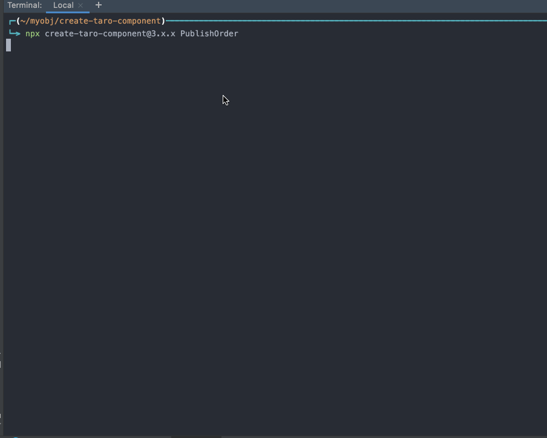

# Create React Component


```
create-taro-component Alert
```

will create

```
Alert
├── Alert.tsx
└── Alert.scss
```

## How to install

```

npm install -g npx
npx create-taro-component Alert
alias gcmb="npx create-taro-component"

//or

npm install -g create-taro-component
alias ctc="create-taro-component"


```



